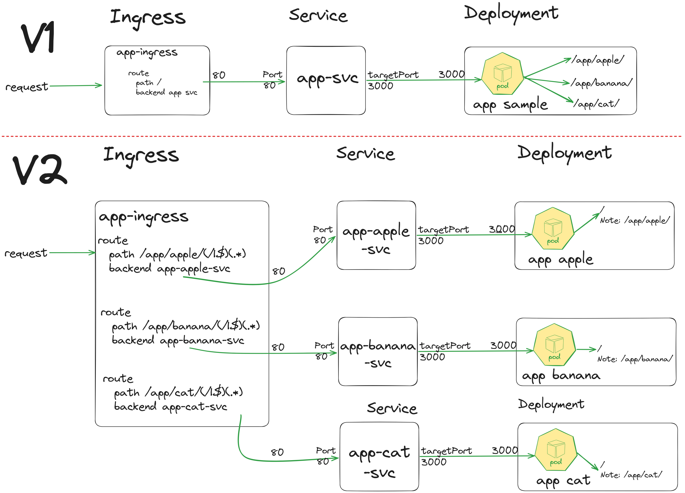

# Overview



# HOW TO RUN & TEST

```bash
node server.js

curl http://localhost:3000/greeting

curl "http://localhost:3000/greeting?name=John"
```

# Build Container

```bash
docker build -t pingkunga/g1w7split .

docker run -dp 3000:3000 -e message="pingkunga" pingkunga/g1w7split 

docker push pingkunga/g1w7split

#Monolith
curl http://localhost:3000/group-1/tcc-10

curl http://localhost:3000/group-1/tcc-01

curl http://localhost:3000/group-1/tcc-26

#split env จริงๆต้อง Build Container แยกแต่ละคน แต่เพื่อความสะดวกในการทดลอง จะใช้ Container เดียวกัน
curl http://localhost:3000/
```

# VS Code Extension

* Kubernetes (https://marketplace.visualstudio.com/items?itemName=ms-kubernetes-tools.vscode-kubernetes-tools)
* Kubernetes Support (https://marketplace.visualstudio.com/items?itemName=ipedrazas.kubernetes-snippets) 
* Kubernetes Templates (https://marketplace.visualstudio.com/items?itemName=lunuan.kubernetes-templates)

# Deploy to Kubernetes V1
  
```bash
kubectl create namespace group-1
kubectl create deployment g1w7 --image=pingkunga/g1w7 -n group-1 --dry-run=client -o yaml > g1w7.yaml
kubectl apply -f g1w7.yaml
kubectl expose deployment g1w7 --port=80 --target-port=3000 -n group-1 -o yaml --dry-run=client -o yaml > g1w7-svc.yaml
kubectl apply -f g1w7-svc.yaml

#note ingressold ต้องแก้่เป็น Client ก่อน
kubectl apply -f ingressold.yaml


```

# Deploy to Kubernetes V2

```bash

#check context first
kubectl config get-contexts
kubectl config use-context [put context name here]

#create namespace
kubectl create namespace group-1s

#create deployment + service g1w7-1
kubectl create deployment g1w7-1 --image=pingkunga/g1w7split -n group-1s --dry-run=client -o yaml > g1w7-1.yaml
#edit yaml file to add env
  template:
    metadata:
      labels:
        app: g1w7_1
    spec:
      containers:
      - image: pingkunga/g1w7split
        name: g1w7split
        env:
        - name: message
          value: "pingkung_a123"  << แก้ตามโจทย์

kubectl apply -f g1w7-1.yaml

kubectl expose deployment g1w7-1 --name=g1w7-1-svc --port=80 --target-port=3000 -n group-1s -o yaml --dry-run=client -o yaml > g1w7-1-svc.yaml
kubectl apply -f g1w7-1-svc.yaml


#create deployment + service g1w7-2
kubectl create deployment g1w7-2 --image=pingkunga/g1w7split -n group-1s --dry-run=client -o yaml > g1w7-2.yaml
#edit yaml file to add env
   ...
        env:
        - name: message
          value: "pingkung_b123"
   ...
kubectl apply -f g1w7-2.yaml

kubectl expose deployment g1w7-2 --name=g1w7-2-svc --port=80 --target-port=3000 -n group-1s -o yaml --dry-run=client -o yaml > g1w7-2-svc.yaml
kubectl apply -f g1w7-2-svc.yaml

#create deployment + service g1w7-3
kubectl create deployment g1w7-3 --image=pingkunga/g1w7split -n group-1s --dry-run=client -o yaml > g1w7-3.yaml
#edit yaml file to add env
   ...
        env:
        - name: message
          value: "pingkung_c789"
   ...
kubectl apply -f g1w7-3.yaml
kubectl expose deployment g1w7-3 --name=g1w7-3-svc --port=80 --target-port=3000 -n group-1s -o yaml --dry-run=client -o yaml > g1w7-3-svc.yaml
kubectl apply -f g1w7-3-svc.yaml

#check 
kubectl get deployment,svc,ep -owide -n group-1s 

#create ingress controller config'
#cannot create ingress controller from kubectl command
#ปรับ path ตามโจทย์นะ

file ingress.yaml
Ref: https://kubernetes.github.io/ingress-nginx/examples/rewrite/

kubectl apply -f ingress.yaml
```


```bash
PS D:\2023TCC\Week7\lab\SplitService\javascript> kubectl describe ingress g1w7-ingress -n group-1s
Name:             g1w7-ingress
Labels:           name=myingress
Namespace:        group-1s
Address:          10.104.11.124,10.104.11.133,10.104.14.111,10.104.4.229
Ingress Class:    nginx
Default backend:  <default>
Rules:
  Host                    Path  Backends
  ----                    ----  --------
  tcc-01.th1.proen.cloud
                          /group-1/tcc-1(/|$)(.)   g1w7-1-svc:80 (10.239.112.9:3000)
                          /group-1/tcc-2(/|$)(.)   g1w7-2-svc:80 (10.239.112.17:3000)
                          /group-1/tcc-3(/|$)(.)   g1w7-3-svc:80 (10.239.176.15:3000)
Annotations:              nginx.ingress.kubernetes.io/rewrite-target: /$2
                          nginx.ingress.kubernetes.io/use-regex: true
Events:
  Type    Reason  Age                From                      Message
  ----    ------  ----               ----                      -------
  Normal  Sync    12m (x2 over 13m)  nginx-ingress-controller  Scheduled for sync
  Normal  Sync    12m (x2 over 13m)  nginx-ingress-controller  Scheduled for sync
  Normal  Sync    12m (x2 over 13m)  nginx-ingress-controller  Scheduled for sync
  Normal  Sync    12m (x2 over 13m)  nginx-ingress-controller  Scheduled for sync
  
```
kubectl get pods -A | Select-String ingress*
kubectl get pods -A | grep ingress*

kubectl exec -it -n <namespace-of-ingress-controller> <nginx-ingress-controller-pod-name> -- cat /etc/nginx/nginx.conf

kubectl exec -it -n ingress-nginx  nginx-ingress-controller-cl4fn -- cat /etc/nginx/nginx.conf

kubectl logs -n ingress-nginx nginx-ingress-controller-cl4fn


kubectl run --rm -it --tty pingkungcurl1 -n group-1s --image=curlimages/curl --restart=Never -- 

kubectl run --rm -it --tty pingkungcurl1 -n group-1s --image=curlimages/curl --restart=Never -- g1w7-1-svc.group-1s
Should Return: {"message":"pingkung_a123"}

kubectl run --rm -it --tty pingkungcurl1 -n group-1s --image=curlimages/curl --restart=Never -- g1w7-2-svc.group-1s
Should Return: {"message":"pingkung_b456"}

kubectl run --rm -it --tty pingkungcurl1 -n group-1s --image=curlimages/curl --restart=Never -- g1w7-3-svc.group-1s
{"message":"pingkung_c789"}


Add http / https
```
PS D:\2WarRoom\2023TCC\Week7\lab\SplitService\javascript> kubectl run --rm -it --tty pingkungcurl1 -n group-1s --image=curlimages/curl --restart=Never -- http://g1w7-3-svc.group-1s
{"message":"pingkung_c789"}pod "pingkungcurl1" deleted
PS D:\2WarRoom\2023TCC\Week7\lab\SplitService\javascript>
PS D:\2WarRoom\2023TCC\Week7\lab\SplitService\javascript> kubectl run --rm -it --tty pingkungcurl1 -n group-1s --image=curlimages/curl --restart=Never -- https://g1w7-3-svc.group-1s
If you don't see a command prompt, try pressing enter.

curl: (28) Failed to connect to g1w7-3-svc.group-1s port 443 after 129809 ms: Couldn't connect to server
E1029 08:21:38.733174   24496 v2.go:104] EOF
```
